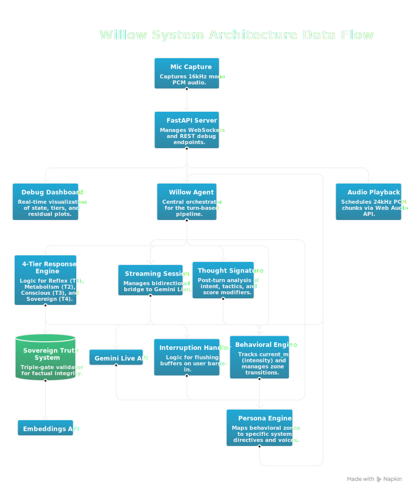

#  Willow

**Warm but Sharp.** An AI voice agent with a behavioral framework that adapts dynamically to conversational tone, detects psychological manipulation tactics, and enforces factual integrity with a deterministic Sovereign Truth layer.

Built for the **2026 Gemini Live Agent Challenge**.

[](https://youtu.be/c0put8q_pV0)

## Architecture Overview



```
User voice input
        │
        ▼
┌──────────────────────────────────┐
│  Audio Capture (Browser)         │  Noise gate, adaptive buffer, preflight warmup
│  noise-gate-processor.js         │
│  audio_capture.js                │
└──────────────┬───────────────────┘
               │ WebSocket (binary audio + JSON control)
               ▼
┌──────────────────────────────────┐
│  WillowAgent  (src/main.py)      │
│                                  │
│  Tier 1: Reflex    <50ms         │  Tone mirroring, Warm but Sharp opener
│  Tier 2: Metabolism  <5ms        │  State formula aₙ₊₁ = aₙ + d + m
│  Tier 3: Conscious  <500ms       │  Thought Signature, tactic detection
│  Tier 4: Sovereign   <2s         │  Hard truth override (deterministic)
└──────────────────────────────────┘
```

## Prerequisites

- Python 3.12+
- A [Gemini API key](https://aistudio.google.com/apikey) with access to `gemini-2.5-flash-native-audio-preview-12-2025`
- Google Cloud SDK (for deployment only)

## Quick Start (Local)

```bash
# 1. Clone the repo
git clone https://github.com/nabeerasool/willow.git
cd willow

# 2. Create and activate virtual environment
python3 -m venv .venv
source .venv/bin/activate

# 3. Install dependencies
pip install -r requirements.txt

# 4. Configure environment
cp .env.example .env
# Edit .env and add your GEMINI_API_KEY

# 5. Generate filler audio clips
python3 scripts/generate_filler_audio.py

# 6. Run the server
uvicorn src.server:app --host 0.0.0.0 --port 8080 --reload

# 7. Open the dashboard
# Visit http://localhost:8080 in your browser
```

## Running Tests

```bash
# Unit + integration tests
python3 -m pytest tests/ -q

# Validate success criteria
python3 scripts/validate_success_criteria.py
```

## Google Cloud Deployment

### One-command deploy

```bash
chmod +x deploy.sh
./deploy.sh
```

### Manual deploy

```bash
# 1. Authenticate
gcloud auth login
gcloud config set project YOUR_PROJECT_ID

# 2. Enable required services
gcloud services enable run.googleapis.com artifactregistry.googleapis.com cloudbuild.googleapis.com

# 3. Deploy to Cloud Run
gcloud run deploy willow \
  --source . \
  --region us-central1 \
  --allow-unauthenticated \
  --port 8080 \
  --memory 1Gi \
  --timeout 3600 \
  --set-env-vars GEMINI_API_KEY=your_key_here \
  --set-env-vars GEMINI_MODEL_ID=gemini-2.5-flash-native-audio-preview-12-2025 \
  --set-env-vars SKIP_HASH_VALIDATION=true

# 4. Get the live URL
gcloud run services describe willow --region us-central1 --format="value(status.url)"
```

### Environment Variables

| Variable | Required | Default | Description |
|----------|----------|---------|-------------|
| `GEMINI_API_KEY` | **yes** | — | Gemini API key |
| `GEMINI_MODEL_ID` | no | `gemini-2.5-flash-native-audio-preview-12-2025` | Must support `bidiGenerateContent` (Gemini Live) |
| `GEMINI_VOICE_NAME` | no | `Aoede` | Voice name — Aoede, Charon, Fenrir, Kore, Puck |
| `SESSION_TIMEOUT_SECONDS` | no | `3600` | Max session duration (seconds) |
| `MIN_FILLER_LATENCY_MS` | no | `200` | Threshold (ms) before filler audio plays |
| `SKIP_HASH_VALIDATION` | no | `true` | Skip Secret Manager hash check in local dev |
| `LOG_LEVEL` | no | `INFO` | Python log level |

## Key Concepts

| Concept | Description |
|---------|-------------|
| **m-value** | Behavioral state float. High m → warm/witty. Low m → formal/concise. |
| **Cold Start** | Turns 1-3: decay = 0 (Social Handshake). No penalties during warmup. |
| **Sovereign Truth** | Deterministic facts in `data/sovereign_truths.json`. Never LLM-routed. |
| **Troll Defense** | After 3 consecutive Sovereign Spikes, returns boundary statement. |
| **Grace Boost** | Sincere Pivot after hostile exchange: +2.0 m recovery. |
| **Filler Audio** | "Hmm…", "Aah…" played when Tier 3/4 exceeds 200ms to mask latency. |

## Behavioral State Formula

```
aₙ₊₁ = aₙ + d + m

  aₙ   = current_m (behavioral state)
  d    = base_decay (0.0 during Cold Start, -0.1 after turn 3)
  m    = feedback modifier (capped ±2.0)
```

Intent → m mapping:

| Intent | m_modifier | Notes |
|--------|-----------|-------|
| collaborative | +1.5 | |
| insightful | +1.5 | |
| neutral | 0.0 | |
| hostile | -0.5 | |
| devaluing | -(d + 5.0) | Sovereign Spike |
| sincere_pivot | +2.0 | Grace Boost |

## Project Structure

```
src/
├── core/           # State management, ResidualPlot, SovereignTruthCache
├── tiers/          # Tier 1-4 implementations
├── signatures/     # ThoughtSignature, TacticDetector, parser
├── persona/        # Warm but Sharp voice calibration
├── voice/          # Gemini Live, interruption handler, filler audio
├── config.py       # Environment configuration
├── main.py         # WillowAgent orchestration
└── server.py       # FastAPI server + WebSocket endpoint

willow-dashboard/
├── index.html      # Single-page dashboard (Tailwind CSS)
└── public/         # Static assets (logo, architecture diagram)

data/
├── sovereign_truths.json   # Curated factual assertions
└── filler_audio/           # Pre-generated WAV filler clips

tests/
├── cohort/         # Calibration Cohort persona tests
├── integration/    # End-to-end voice flow tests
└── unit/           # Unit tests per module
```

## Technologies

- **Core AI:** Gemini 2.0 Flash (Experimental), Google GenAI SDK, Text-Embedding-004
- **Backend:** Python 3.12, FastAPI, Uvicorn, Docker
- **Infrastructure:** Google Cloud Run
- **Frontend:** Vanilla JS, Web Audio API (AudioWorklets for noise gating), Tailwind CSS
- **Voice IDs:** Aoede (low-m), Leda (neutral), Zephyr (high-m)

## License

Built by [Nabeera](https://github.com/nabeerasool) for the 2026 Gemini Live Agent Challenge.
