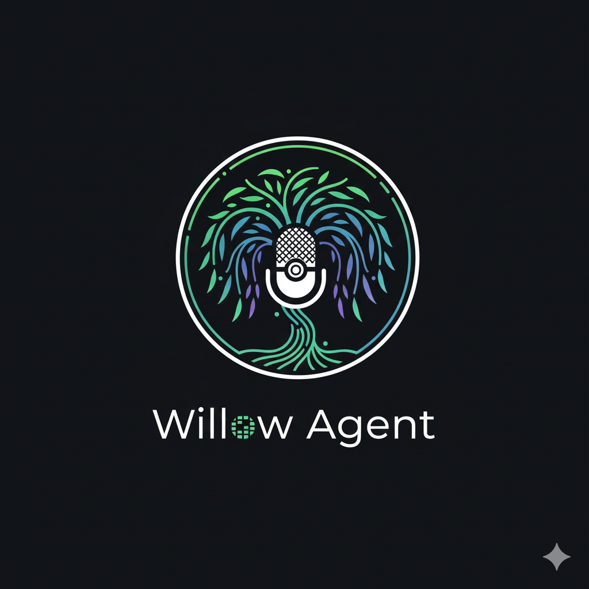

#  Willow

**Warm but Sharp.** An AI voice agent with a behavioral framework that adapts dynamically to conversational tone, detects psychological manipulation tactics, and enforces factual integrity with a deterministic Sovereign Truth layer.

## Architecture Overview

```
User voice input
        │
        ▼
┌──────────────────────────────────┐
│  Audio Capture (Browser)         │  Noise gate, adaptive buffer, preflight warmup
│  noise-gate-processor.js         │  spec 002: T024, T026, T027, T028
│  audio_capture.js                │
└──────────────┬───────────────────┘
               │ WebSocket (binary audio + JSON control)
               ▼
┌──────────────────────────────────┐
│  WillowAgent  (src/main.py)      │
│                                  │
│  Tier 1: Reflex    <50ms         │  Tone mirroring, Warm but Sharp opener
│  Tier 2: Metabolism  <5ms        │  State formula aₙ₊₁ = aₙ + d + m
│  Tier 3: Conscious  <500ms       │  Thought Signature, tactic detection
│  Tier 4: Sovereign   <2s         │  Hard truth override (deterministic)
└──────────────────────────────────┘
```

## Quick Start

```bash
# 1. Clone and install
pip install -r requirements.txt

# 2. Configure
cp .env.example .env
# Add your GEMINI_API_KEY to .env

# 3. Generate filler audio clips
python3 scripts/generate_filler_audio.py

# 4. Run tests
python3 -m pytest tests/ -q

# 5. Validate success criteria
python3 scripts/validate_success_criteria.py
```

## Google Cloud Deployment

```bash
# Set your project
gcloud config set project YOUR_PROJECT_ID

# Enable required services
gcloud services enable run.googleapis.com

# Deploy
gcloud run deploy willow \
  --source . \
  --region us-central1 \
  --allow-unauthenticated \
  --port 8080 \
  --memory 1Gi \
  --timeout 3600 \
  --set-env-vars GOOGLE_API_KEY=your_key_here \
  --set-env-vars GEMINI_MODEL_ID=gemini-2.5-flash-native-audio-preview-12-2025
```

Required environment variables:

| Variable | Required | Default | Description |
|----------|----------|---------|-------------|
| `GEMINI_API_KEY` | **yes** | — | Gemini API key (SDK prefers this over `GOOGLE_API_KEY`) |
| `GEMINI_MODEL_ID` | no | `gemini-2.5-flash-native-audio-preview-12-2025` | Must support `bidiGenerateContent` (Gemini Live) |
| `GEMINI_VOICE_NAME` | no | `Aoede` | Voice name — options: Aoede, Charon, Fenrir, Kore, Puck |
| `SESSION_TIMEOUT_SECONDS` | no | `3600` | Max session duration in seconds |
| `MIN_FILLER_LATENCY_MS` | no | `200` | Threshold (ms) before filler audio plays to mask latency |
| `GCP_PROJECT_ID` | no | `willow-agent` | Google Cloud project ID |
| `SKIP_HASH_VALIDATION` | no | `true` | Set `true` in local dev to skip Secret Manager hash check |
| `ENABLE_CLOUD_LOGGING` | no | `false` | Enable Google Cloud structured logging |
| `LOG_LEVEL` | no | `INFO` | Python log level (DEBUG, INFO, WARNING, ERROR) |
| `TIER1_BUDGET_MS` | no | `50` | Latency budget for Tier 1 Reflex (ms) |
| `TIER2_BUDGET_MS` | no | `5` | Latency budget for Tier 2 Metabolism (ms) |
| `TIER3_BUDGET_MS` | no | `500` | Latency budget for Tier 3 Conscious (ms) |
| `TIER4_BUDGET_MS` | no | `2000` | Latency budget for Tier 4 Sovereign (ms) |

## Key Concepts

| Concept | Description |
|---------|-------------|
| **m-value** | Behavioral state float. High m → warm/witty. Low m → formal/concise. |
| **Cold Start** | Turns 1-3: decay = 0 (Social Handshake). No penalties during warmup. |
| **Sovereign Truth** | Deterministic facts in `data/sovereign_truths.json`. Never LLM-routed. |
| **Troll Defense** | After 3 consecutive Sovereign Spikes, returns boundary statement. |
| **Grace Boost** | Sincere Pivot after hostile exchange: +2.0 m recovery. |
| **Filler Audio** | "Hmm…", "Aah…" played when Tier 3/4 exceeds 200ms to mask latency. |

## Project Structure

```
src/
├── core/           # State management, ResidualPlot, SovereignTruthCache
├── tiers/          # Tier 1-4 implementations
├── signatures/     # ThoughtSignature, TacticDetector, parser
├── persona/        # Warm but Sharp voice calibration
├── voice/          # Gemini Live, interruption handler, filler audio
│   └── static/     # AudioWorklet: noise-gate-processor.js, audio_capture.js
├── config.py       # Environment configuration
└── main.py         # WillowAgent orchestration

tests/
├── cohort/         # Calibration Cohort persona tests
├── integration/    # End-to-end voice flow tests
└── unit/           # Unit tests per module

data/
├── sovereign_truths.json   # Curated factual assertions
└── filler_audio/           # Pre-generated WAV filler clips

scripts/
├── verify_residual_plot.py
├── verify_state_formula.py
├── benchmark_tiers.py
├── test_filler_audio.py
└── validate_success_criteria.py

specs/
├── 001-willow-behavioral-framework/   # Core behavioral spec, plan, tasks
└── 002-gemini-audio-opt/              # Audio optimisation spec, plan, tasks
```

## Behavioral State Formula

```
aₙ₊₁ = aₙ + d + m

  aₙ   = current_m (behavioral state)
  d    = base_decay (0.0 during Cold Start, -0.1 after turn 3)
  m    = feedback modifier (capped ±2.0)
```

Intent → m mapping:

| Intent | m_modifier | Notes |
|--------|-----------|-------|
| collaborative | +1.5 | |
| insightful | +1.5 | |
| neutral | 0.0 | |
| hostile | -0.5 | |
| devaluing | -(d + 5.0) | Sovereign Spike |
| sincere_pivot | +2.0 | Grace Boost |

## Spec References

- `specs/001-willow-behavioral-framework/` — Core behavioral framework
- `specs/002-gemini-audio-opt/` — Audio optimisation (noise gate, adaptive buffer)
- `docs/architecture.md` — Detailed architecture
- `docs/api-contracts.md` — WebSocket and REST contracts
- `docs/calibration-cohort-guide.md` — Testing persona calibration
