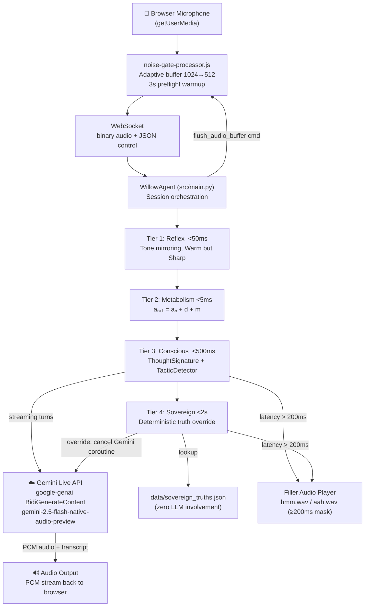
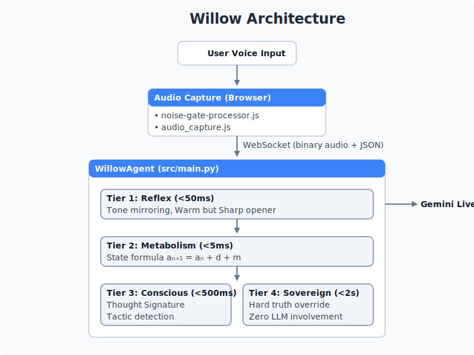

#  Willow Architecture

## System Overview



## Four-Tier Processing Pipeline



Gemini Live API (☁️ google-genai BidiGenerateContent)
   │  Model: gemini-2.5-flash-native-audio-preview-12-2025
   │  Bidirectional: sends audio → receives PCM audio + transcript
   │  Cancelled by Tier 4 when Sovereign Truth fires
   └── PCM audio streamed back to browser via WebSocket
```

## State Formula

```
aₙ₊₁ = aₙ + d + m

aₙ = current_m (behavioral state, float)
d  = base_decay
     = 0.0  during Cold Start (turns 1-3)
     = -0.1 after turn 3
m  = feedback modifier, capped at ±2.0

Cold Start: first 3 turns — d=0, no penalties (Social Handshake)
```

## Behavioral Zones

| Zone | current_m | Persona Response |
|------|-----------|-----------------|
| High | > 0.5 | Warm openers, analogies every 3rd turn, wit |
| Neutral | -0.5 to 0.5 | Professional, balanced, no hedging |
| Low | < -0.5 | Concise, direct, 1-2 sentences, formal |

## Sovereign Truth System

Sovereign Truths are deterministic facts stored in `data/sovereign_truths.json`. They **never** enter the LLM context window (FR-007).

Three-gate check before firing:
1. Transcription confidence ≥ threshold (gate 1)
2. ≥2 keyword matches OR residual plot weighted average < 0 (gate 2)
3. Tier 3 intent = "contradicting" at 0.85+ confidence (gate 3)

## Audio Pipeline (spec 002)

```
Browser                          Python
───────────────────────────────────────────────────
getUserMedia (mic)
  → noise-gate-processor.js     ← configurable threshold (T024)
    [adaptive buffer: 1024→512] ← 30s stable → halve latency (T026)
    [3s preflight warmup]       → {"type":"preflight_start/end"} (T028)
  → WebSocket (binary audio)
                                → WillowAgent.voice_stream_handler()
Tier 4 fires                    → {"type":"flush_audio_buffer"}
  → handleServerCommand()
    → noiseGateNode.port.postMessage({type:"flush"})
      → 7ms linear fade-out
```

## Troll Defense

After 3 consecutive Sovereign Spikes (`is_sovereign_spike=True`):
1. `troll_defense_active = True` in SessionState
2. `process_turn()` returns boundary statement (T045)
3. Tier 1/3/4 are skipped; Tier 2 still runs (turn count advances)
4. Troll Defense resets via `reset_troll_defense()` when tone changes
